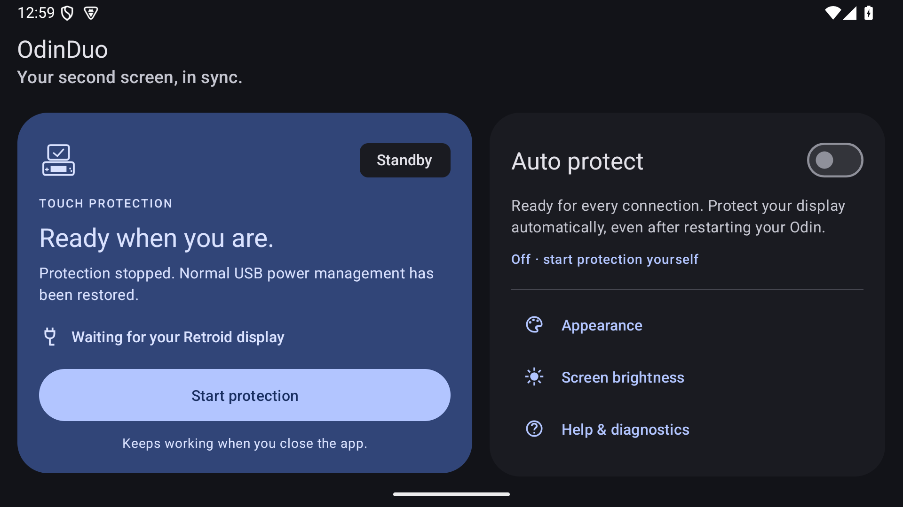

# OdinDuo

Keep your **Retroid Dual Screen touchscreen working through sleep and wake on the AYN Odin 3**.

OdinDuo applies a temporary USB power-management workaround through the stock AYN service. Its English Material 3 dashboard follows your wallpaper colours and offers system, light and dark themes. Enable **Auto protect** once to keep it ready for every display connection.



## Download

Download [OdinDuo 2.0.0](https://github.com/Tufein/OdinDuo/releases/tag/v2.0.0), the latest full release. The signed, non-debuggable APK keeps the same package and signing certificate for an in-place update from 1.1.0. An APK checksum accompanies the download; private signing keys are never published.

The 2.0.0 debug/release builds, Android lint and GitHub CI pass. The new version has not yet been tested on stock Odin 3 hardware; earlier physical touch validation applies to 1.1.0. See the [release validation](docs/releases/2.0.0.md).

**After updating, Stop protection once and enable Auto protect again** to start the updated helper. Version 2.0 adds session duration, bounded local history, guided setup, a manual connection and wake checklist, clearer recovery notifications and optional Dutch per-app language support. See [the 2.0.0 release notes](docs/releases/2.0.0.md).

Development is now on **2.0.1**: boot/session recovery, accurate elapsed timing, safer history, live English/Dutch status and Retry after an unexpected helper stop. Stock Odin update, service restart, recents dismissal, notification Retry and automatic startup after reboot/unlock pass. The candidate still awaits repeated physical Retroid touch checks. See [candidate notes](docs/releases/2.0.1.md) and the [roadmap](docs/roadmap.md).

## Use

1. Open **OdinDuo** and turn on **Auto protect**, or tap **Start protection** for a single session.
2. Connect the Retroid Dual Screen and wait for **Protected**.
3. Return to your launcher. Protection continues when you swipe OdinDuo out of recent apps and during sleep.
4. Unplug the display: its original USB power settings return. With Auto protect enabled, OdinDuo stays ready and protects the next connection automatically.

**Auto protect** is off by default. Enabling it starts a visible foreground service that waits for the display, including while the app is closed. It requests restoration of this opted-in mode after reboot and app updates. No USB power settings are changed while waiting. Turn Auto protect off to keep only the current active session; **Stop protection** or the notification’s **Stop** action ends protection and switches Auto protect off too.

Android may ask for notification permission. Allow it to see background status and the Stop action. Android’s **Force stop** or **Active apps → Stop** can still end the app; reopen OdinDuo to resume. Its own Stop button confirms immediate restoration; after unexpected process loss the helper allows a bounded restart grace before restoring.

**Appearance** lets you choose system, light or dark mode. **Help & diagnostics → Share diagnostics** exports only the app’s bounded logs and basic device/version information through Android’s share sheet. Nothing is sent automatically; the app has no internet permission.

The dashboard shows the current session duration and the Odin’s whole-device battery level when Android provides it. **Session history** keeps a bounded local timeline and can be cleared. **Connection & wake test** is a manual checklist for touch while connected, after sleep/wake and after reconnect; it records only which checks passed.

Open **Check setup** to add OdinDuo to Android Quick Settings. Tapping the tile when off enables Auto protect; tapping it while protection is running stops protection and turns Auto protect off. Its subtitle follows the actual protection state. Long-press opens OdinDuo. Locked devices require unlocking before a tap changes protection. Status changes request a system tile refresh, including when the panel is closed; the tile has no periodic polling loop.

**Check setup** reports the stock AYN service, primary Android user, notification permission, Android background restrictions, battery optimisation and Auto protect setting. **App settings** opens Android’s per-app settings so you can adjust restrictions yourself. These checks also appear in shared diagnostics. The helper paths support the primary Android user; other profiles cannot start protection. Notification permission is requested once rather than again after a theme change.

**Screen brightness → Match your screens** explains how to match brightness manually and opens Android Display settings. Show the same image on both screens, adjust the Odin brightness and use the Retroid display’s hardware buttons to match by eye. Disable adaptive brightness on the Odin if you want the match to stay consistent. Equal slider percentages do not imply equal light output from different panels.

Automatic brightness synchronisation is **not available on the tested Odin 3 + Retroid Dual Screen setup**. Android reports no SurfaceControl brightness support or backlight for the external display. Three DDC/CI brightness queries over its identified DisplayPort AUX bus returned all-zero responses rather than a valid brightness value. No brightness-setting packets were sent. Retroid [documents dedicated brightness buttons](https://www.goretroid.com/products/retroid-dual-screen-add-on); no usable software brightness controller was established in this investigation.

**Compatibility:** tested on an AYN Odin 3 running Android 15, firmware `Odin3_V1.0.0.187_20260616_193307_user`, with the Retroid touchscreen `222a:0001`. Other devices, firmware versions and USB topologies are unverified. Android 13 or newer is required, but the stock AYN service and the expected Odin 3 USB topology must also be present.

Keeping USB awake may use extra battery, including during sleep. Battery impact has not been measured. This prevents the observed failure during an active session; it is not a guaranteed recovery method for a touchscreen that has already stopped responding.

## How it works

During investigation, Android restored the display and input mapping after wake, while the Retroid USB device and host remained runtime-suspended and stopped delivering raw touch events. Preventing runtime autosuspend on the Retroid USB chain kept touch working in the successful physical test.

OdinDuo uses the existing privileged **AYN `PServerBinder` service** to run its bundled shell guard as UID 0. Installing Magisk, unlocking the bootloader or flashing firmware is not needed on the tested stock Odin. This is privileged execution through a vendor service; firmware changes can affect availability.

The guard:

- Matches only USB vendor/product `222a:0001` and the actual ancestor chain under `/sys/devices/platform/soc/a600000.ssusb`.
- Saves original `power/control` values and device identities before setting them to `on`; verifies writes and reapplies them if firmware overwrites them.
- Restores saved settings in reverse order on Stop or detach. Closing the UI does not end the session. It skips removed or replaced USB devices and values changed independently.
- Ties the session to the foreground service’s PID, process start time, UID, package name and a unique marker. The service runs in its own `:guard` process and uses Android’s `START_STICKY` restart policy. Atomic status snapshots let the reopened UI display the existing session without starting a duplicate guard.
- Allows up to 60 seconds for Android to restart an unexpectedly killed service process; the restarted service adopts the existing guard and keeps the saved USB settings. If no valid owner returns, the guard restores settings and exits. Explicit Stop bypasses this grace period. A separate watchdog handles unexpected worker termination.
- Retains restoration snapshots if a write fails rather than silently discarding them.

OdinDuo checks the helper’s session heartbeat before reporting protection. If it disappears, the UI shows **Recovering** rather than a historical **Protected** sample. After a grace period, Auto protect confirms USB restoration before relaunching; manual sessions end with an error. Unexpected helper exits are limited to two recovery attempts per 60 seconds of awake uptime. Normal display detach/reconnect is not counted as a failure. The grace period uses Android uptime, excluding deep sleep, so a stale heartbeat immediately after waking does not trigger a restart. Persistent failure or unconfirmed restoration stops the session and leaves diagnostics available. With notifications allowed, a failure notification offers **Retry protection**; the dashboard offers the same action. Retrying must first confirm restoration of any previous session, even if its marker is already missing.

In beta.2, the helper atomically publishes its current WAITING, STARTING or ACTIVE observation alongside its session heartbeat. A busy diagnostic log cannot push the last good power sample outside the read window and cause a healthy helper to stop. Fatal log errors and confirmed shutdown still take precedence. A session adopted from an earlier APK remains compatible; after upgrading, **Stop protection once and re-enable Auto protect** to start the updated helper.

Restoration now verifies that each written value can be read back unchanged. Read failures, invalid snapshots and mismatched readback retain the snapshots and prevent a successful Stop acknowledgement or new session.

Stock PServer accepted the original 365-character compound Stop request without executing its restoration acknowledgement. This stopped automatic connection handling after detach on the physical Odin. A separate bundled stop helper now performs restoration and writes the unique acknowledgement; the Binder request only launches that helper. It also works with a guard left by an earlier APK. Protection rearms only after successful confirmation, and pending restoration snapshots still block a new session.

The stock-service lookup has a `PrivateApi` lint exception scoped to `VendorBridge.service()`: PServer has no public SDK lookup. The exception is documented rather than removing the vendor dependency; unsupported firmware and Android profiles still fail the availability check.

The global `usbcore.autosuspend` setting is untouched. Runtime USB suspension and system sleep are different mechanisms. The app does not request an Android CPU wake lock, inject touches, alter launcher configuration, or request internet access.

**Automatic connection handling:** the running guard detects the Retroid device directly in the USB topology, restores each finished connection before preparing the next, and keeps its foreground notification visible. It does not rely on a cold USB attach broadcast: Android can filter this accessory’s boot-HID interface. Open the app and enable Auto protect once; Android force-stop and firmware background restrictions can require reopening it.

Normal Android USB permission is insufficient for this accessory: its boot-HID interface is filtered from the host API on the tested device. This is why OdinDuo uses the vendor service instead of a USB permission dialog.

## Build and install

Requirements: **JDK 17 or newer**, Android SDK **platform 36**, build-tools **36.0.0**, and platform-tools for ADB installation. The Gradle 9.8.0 wrapper downloads the build tool automatically; Android Gradle Plugin is pinned to 9.1.0 and Material Components to 1.14.0; AppCompat is 1.8.0 and the app targets SDK 36.

Configure `JAVA_HOME` and `ANDROID_HOME` (or `ANDROID_SDK_ROOT`) for your installations. `app/build.sh` also recognises the usual macOS SDK and Homebrew OpenJDK 21 locations.

```sh
./app/build.sh
adb devices -l
adb -s YOUR_ODIN_SERIAL install -r app/build/OdinDuo.apk
adb -s YOUR_ODIN_SERIAL shell am start -n nl.retroid.touchguard/.MainActivity
```

The app remains `nl.retroid.touchguard` so OdinDuo can update the original installation. The source candidate is **2.0.1**, with version code **21** and target SDK **36**; the published full release is 2.0.0.

The canonical guard in `tools/pserver-power-guard.sh` and its stop helper in `tools/pserver-power-stop.sh` are bundled as generated resources during the build. Generated resources, APKs, device captures and signing keys are excluded from Git. `./app/build.sh` produces a debug APK for development. To build the non-debuggable release:

```sh
./app/build.sh release
```

Release signing uses the existing ignored `app/build/debug.keystore` for compatibility with published versions. For your own signing key, set `ODINDUO_KEYSTORE`, `ODINDUO_STORE_PASSWORD`, `ODINDUO_KEY_ALIAS` and `ODINDUO_KEY_PASSWORD` in your local environment. Release builds require a private key; do not commit or publish it. A locally generated debug key cannot reproduce the public release’s signature.

For an existing installation, preserve its signing key when building updates. The project reuses `app/build/debug.keystore` when present; otherwise Gradle uses its normal local debug key. APKs built with a different key cannot update an existing installation in place. Stop protection before uninstalling or replacing an installation.

## Checks

```sh
./tools/check.sh
./gradlew :app:lintRelease
```

GitHub Actions builds both the debug and instrumentation APKs, runs `lintDebug` and `tools/check.sh` for every pull request and pushes to main or Codex branches. The workflow pins actions to commit hashes, installs SDK 36 and build-tools 36.0.0, and requires no release signing key. Its debug artifacts are retained for seven days and use a development certificate; use the release assets for updates to an installed public version. Instrumentation is compiled in CI; run its storage/language suite only on a disposable emulator as described in the [2.0.1 notes](docs/releases/2.0.1.md). The protected main branch requires an up-to-date PR with the Android build and checks result from GitHub Actions, including for administrators.

The checks verify process identity parsing, rejection of truncated records, shell argument quoting without command substitution, USB descriptor/target validation, and log parsing that honours the latest power state and gives restoration failures precedence. The shell integration test runs the real guard against temporary fake proc/USB files: process loss preserves power settings, a reused PID is rejected, a new service adopts the session without resetting USB, explicit Stop restores promptly, and an expired restart grace restores the original settings. It also checks detach acknowledgements across three connection leases, rejects invalid acknowledgement tokens and ensures pending snapshots cannot be acknowledged as successful. It never writes host or connected-device power settings. Emulator checks cannot establish that physical Retroid touch survives sleep.

Physical validation of the workaround recorded three sleep/wake pairs with genuine raw touch events after each wake. The tester reported five uninterrupted cycles in that run. The USB host was active in all 69 recorded samples; the Retroid device was active in 68 samples and briefly suspended in one. The guard corrected six firmware overwrites of the touchscreen's power setting.

The self-contained 0.3 app was subsequently confirmed working by the tester. Start, Stop, launcher/background use and forced app termination were also checked on the Odin. Version 0.5.0 lifecycle checks passed on an isolated Android 15 emulator using a test-only stand-in for the stock PServer service: swiping the app away kept the foreground service running; killing only the service process triggered a sticky restart that adopted the same guard; reopening the UI preserved the session; Stop reported completion only after the guard exited. Cleanup of a leftover 0.4 session was also checked. These emulator lifecycle checks used a service stand-in and cannot replace physical touch testing.

Version 0.4.0 was installed as an in-place update on the same Odin. Its English UI was checked in portrait and landscape, in light and dark mode. Start reached the waiting state; Stop ended the worker and watchdog with the USB controllers still at their original `auto` settings while no RDS was connected. These results cover the tested device and firmware; long-duration reliability and battery use remain unmeasured.

The initial 1.0 build was checked in an isolated Android 15 emulator with a test-only PServer adapter and temporary fake USB files. Three automatic detach/restore/reconnect cycles passed. Closing recents retained protection; killing the service adopted the same existing guard. App replacement resumed automatic mode. A boot-completed receiver invocation and an immediate stop/restart restoration check passed; a complete physical Odin reboot remains unverified. Both themes and orientations were inspected. These simulated checks did not reproduce the stock vendor’s failure to execute the longer Stop command; that failure was subsequently reproduced on the physical Odin and addressed in the updated 1.0.0 APK.

The updated build (version code 7) passed the build, release lint (zero errors) and regression checks, including the stop helper’s success, invalid-token and pending-restoration cases. It installed over 1.0.0 on the physical Odin with the same certificate, resumed the enabled automatic mode after app replacement, confirmed Stop through the stock service and returned to a clean waiting session. The brightness investigation used the connected physical Retroid display; the matching guide and its layout were inspected in an Android 15 emulator. A new physical three-connection touch test was requested separately; its result is not included in these measurements.

Version 1.1.0 passed local debug/release builds, Android lint (zero issues with the documented vendor lookup exception), policy/shell regressions and Android 15 emulator checks. On the stock Odin 3, its actual Quick Settings switch started and stopped protection, and the real notification Retry recovered a deliberately interrupted manual helper session while no Retroid was connected. The final-candidate recording contains 269 raw touch frames after two observed doze/wake cycles and one display reconnect, without touch-reader or sampled protection errors. The tester also completed the beta's five sleep/wake cycles and two reconnect checks; its bounded recording does not independently cover that entire sleep test. See [the release validation](docs/releases/1.1.0.md).

## Diagnostics and removal

The 1.1 regression suite checks for startup timeout, silent helper loss, sleep grace and bounded recovery. The real-shell integration test injects a restoration readback mismatch, checks that Stop fails while preserving snapshots, then confirms a successful retry. Beta.2 also checks current observations with noisy log tails, legacy heartbeat adoption, malformed/future/stale records, and atomic WAITING/ACTIVE transitions. Android emulator regressions cover the reproduced beta.1 log-overflow failure, tile refresh while its panel is closed, a markerless failed restoration, blocked unsafe retries and a successful notification Retry. See [the 1.1.0 release notes](docs/releases/1.1.0.md) for Android checks, physical validation and their limits.

For the published release APK, use **Help & diagnostics → Share diagnostics**. `adb shell run-as` is intentionally unavailable in the non-debuggable release. Diagnostics omit device serial numbers, account information and installed-app lists; session tokens are redacted.

For developer builds, use the Odin’s explicit ADB serial, especially if other devices or emulators are connected:

```sh
python3 tools/collect-usb-open-test.py --serial YOUR_ODIN_SERIAL --kind app
./capture.sh YOUR_ODIN_SERIAL before-sleep
adb -s YOUR_ODIN_SERIAL shell run-as nl.retroid.touchguard cat files/power-guard.txt
adb -s YOUR_ODIN_SERIAL shell run-as nl.retroid.touchguard cat files/guard-events.txt
```

Collectors have bounded waits and save output in the ignored `capture/` directory. Captures can include device identifiers and installed-app information; review them before sharing. App events rotate at 512 KiB and polling reads at most the latest 32 KiB of the power log.

If restoration reports a failure, export diagnostics. **Retry protection** first retries the old restoration and starts a new session only after confirmation; if restoration still fails, the error and snapshots remain. Snapshots remain in `/data/local/tmp/retroid-power-guard-state`. Do not delete that directory to bypass an unresolved restoration.

To remove OdinDuo, tap **Stop protection**, wait for restoration, then:

```sh
adb -s YOUR_ODIN_SERIAL uninstall nl.retroid.touchguard
```

For the separate service process, current UI state is stored in `files/guard-status.json`; session ownership is in `files/guard-owner` and `files/guard-heartbeat`.

The diagnostic logger and previous experimental console helpers remain in `tools/`. USB-port reset, a display cycle and USB data off/on were investigated but did not establish a reliable fix. They are not part of OdinDuo's normal operation.

## Credits and references

- [Crypt0Shmipt0's Odin 3 RDS USB-pinning approach](https://github.com/Crypt0Shmipt0/odin3-rds-touch-fix/blob/48a49f5ca4417682b0a931157947e63579e61a40/scripts/rds_usbpin.sh) informed the power-management workaround. OdinDuo adds chain scoping, original-state restoration and session ownership.
- [AurelioB's ClusterTune PServer implementation](https://github.com/AurelioB/ClusterTune/blob/4920c5a82925772f5765dbee1f4679242a72cada/app/src/main/java/com/aure/clustertune/root/RootExec.kt), which credits **FeralAI's O2P Tweaks**, documents the stock Binder wire format used by OdinDuo's independent adapter.
- [Linux 6.6 USB power management](https://docs.kernel.org/6.6/driver-api/usb/power-management.html) explains runtime autosuspend and `power/control`.
- [AOSP UsbHostManager](https://android.googlesource.com/platform/frameworks/base/+/master/services/usb/java/com/android/server/usb/UsbHostManager.java) documents boot-HID filtering.
- [Android service restart and task-removal behaviour](https://developer.android.com/reference/android/app/Service#START_STICKY) and [Android user-initiated stopping](https://developer.android.com/develop/background-work/services/fgs/handle-user-stopping) explain the lifecycle used in 0.5.0.
- [Android special-use foreground services](https://developer.android.com/develop/background-work/services/fgs/service-types#special-use) and [dynamic colours](https://developer.android.com/develop/ui/views/theming/dynamic-colors) describe the Android APIs used by the app.
- [Android Quick Settings tiles](https://developer.android.com/develop/ui/views/quicksettings-tiles) describes the protected system tile and user-controlled add flow used in 1.1 beta.
- [Material Components for Android](https://github.com/material-components/material-components-android/releases/tag/1.14.0) supplies the Material 3 interface.
- [AOSP LocalDisplayAdapter](https://android.googlesource.com/platform/frameworks/base/+/refs/heads/main/services/core/java/com/android/server/display/LocalDisplayAdapter.java) implements the external display backlight adapter inspected during the brightness investigation.

Independent community project; not affiliated with AYN or Retroid. Original OdinDuo source is available under the [MIT licence](LICENSE). External projects and bundled dependencies retain their respective licences; see [NOTICE.md](NOTICE.md).
